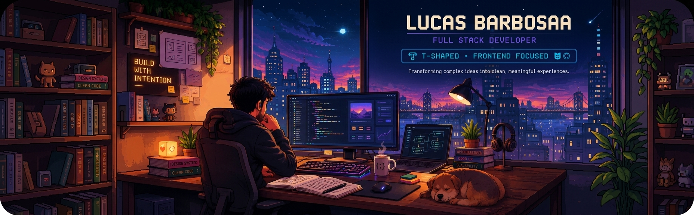

  

  <strong>Full Stack Developer · T-shaped · Frontend focused</strong>

  
  
  
  
  
  
  

  Construo produtos digitais com foco em boas interfaces, arquitetura e código sustentável.

  
  
  

